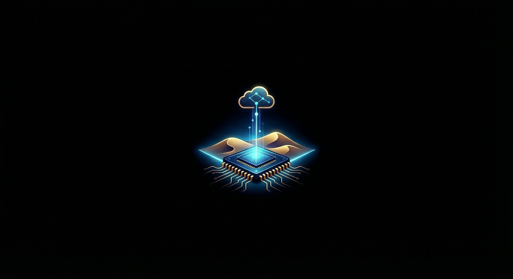
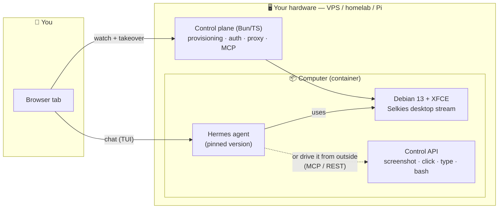

<p align="center">
  
</p>

<h1 align="center">Sandbar</h1>

<p align="center">
  <b>Give an AI agent its own computer. Watch it work. Take over anytime.</b><br/>
  On hardware you already own — a $5 VPS, a homelab box, or a Raspberry Pi.
</p>

<p align="center">
  <a href="LICENSE"></a>
  
  
</p>

---

## What is this?

Sandbar is a **self-hosted AI agent computer**: an isolated Linux desktop in a Docker container with an AI agent pre-installed, and a browser view so you can *watch the agent use the computer* — mouse, keyboard, browser, apps — and grab the controls whenever you want.

- 🖥️ **A real desktop** — Debian + XFCE, streamed to your browser at 60fps ([Selkies](https://github.com/selkies-project/selkies), the same stack behind linuxserver.io's Webtop)
- 🤖 **An agent that lives there** — [Hermes](https://github.com/NousResearch/hermes-agent) by default, version-pinned. OpenClaw and bring-your-own-agent supported
- 👀 **A window you can trust** — live desktop view + agent chat side by side, human takeover at any moment
- 🔒 **Yours** — your hardware, your API keys, your data. No cloud account. No telemetry.

```
┌─────────────────────────────────────────────┬──────────────────┐
│                                             │                  │
│                                             │   agent chat     │
│         live desktop (watch/takeover)       │   (TUI)          │
│                                             │                  │
│                                             │                  │
└─────────────────────────────────────────────┴──────────────────┘
```

## Quick start

> 🔨 **Status: v2 is being built in public.** The single-container image below **works today** (see [`desktop/`](desktop/)); the platform tier is next — see the [roadmap](docs/ROADMAP.md). Star/watch to follow along.

**One computer, one command:**

```bash
docker run -d --name sandbar \
  -p 3000:3000 -p 3001:3001 -p 7681:7681 \
  -v sandbar-config:/config \
  --shm-size=1g \
  ghcr.io/jdrolls/sandbar-desktop:latest
```

Then open:

- **Desktop** — `http://localhost:3000` (or `https://<host>:3001` from another machine; the desktop stream needs a secure context, so remote plain-HTTP won't render)
- **Agent chat** — `http://localhost:7681` — first run walks you through connecting a provider (Nous Portal OAuth, Anthropic, OpenAI, OpenRouter, local models…). No key baked in, ever. Passing `-e ANTHROPIC_API_KEY=...` (or any provider key) skips onboarding.

**The full platform (provision many computers, API, MCP):**

```bash
curl -fsSL https://raw.githubusercontent.com/jdrolls/sandbar/main/install.sh | bash
```

The installer detects your architecture, sets up Docker if needed, generates secrets, and walks you through setup — then prints your URL. Private-by-default: the recommended access path is [Tailscale](https://tailscale.com) (zero open ports), with Cloudflare Tunnel and plain HTTPS as documented alternatives.

## How it works



One container is a complete, watchable agent computer. The control plane is **optional** — add it when you want to provision multiple computers, hand out API keys, or plug Sandbar computers into Claude Code / any MCP client as native tools.

## Who is this for?

You, probably, if you:

- like to **tinker and self-host** — you'd rather run it on your own box than sign up for a cloud
- want to **experiment with AI agents** without giving one your actual computer
- believe **watching an agent work** beats trusting a log file
- care about **isolation**: the agent gets root on *its* computer, never on yours

## The agent is a guest, not the house

Sandbar's agent layer is a thin adapter contract — the computer doesn't care who lives in it:

| Adapter | Status | Notes |
|---|---|---|
| **Hermes** | default | Multi-provider models (Anthropic, OpenAI, OpenRouter, local Ollama), desktop computer-use, 20+ chat channels via its gateway |
| **OpenClaw** | supported | Containment mode — run the internet's favorite agent inside a jail with a window |
| **None / BYO** | supported | Point your own agent (or Claude Code via MCP) at the control API |

## Security posture

- Non-root agent user inside the container; hardened runtime (`no-new-privileges`, per-computer networks)
- No Docker socket in anything internet-facing
- Every surface authenticated — desktop, terminal, and API routes all require tokens
- Private-by-default access (Tailscale first); public exposure is an explicit choice
- Agent versions pinned — no `@latest` surprises
- Optional stronger isolation tiers on the roadmap: [sysbox](https://github.com/nestybox/sysbox), [gVisor](https://gvisor.dev)

See [SECURITY.md](SECURITY.md) for reporting.

## Learn more

- 📐 [Design](docs/DESIGN.md) — the full architecture and every decision with its reasoning
- 🗺️ [Roadmap](docs/ROADMAP.md) — what's built, what's next
- 🧪 [Spike](spike/) — the current proving ground (watch this space)

## License

[MIT](LICENSE) — use it, fork it, ship it.
