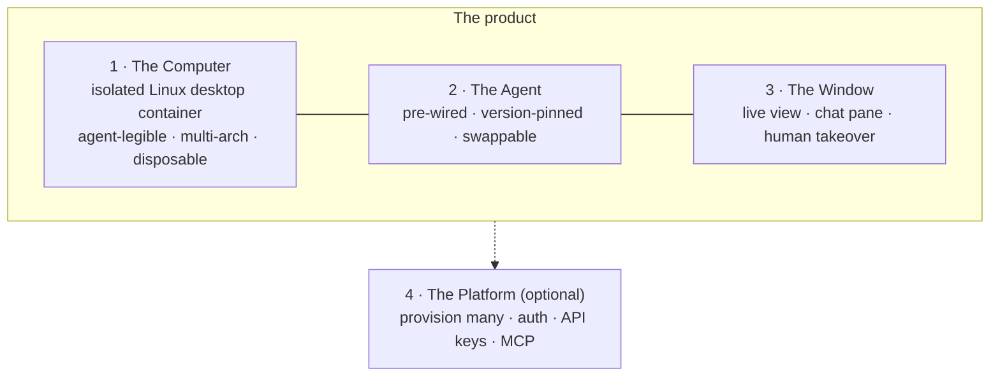
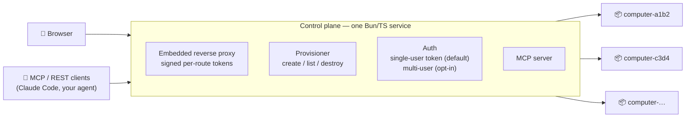

# Sandbar Design

> The complete architecture, and the reasoning behind every decision.
> Last updated: 2026-07-19

## The one-sentence product

**Give an AI agent its own computer. Watch it work. Take over anytime. On hardware you already own.**

Everything below serves that sentence. Anything that doesn't is cut, or made optional.

## Why Sandbar exists

Three things are true in mid-2026:

1. **The seat is empty.** Bytebot — the 11k-star "self-hosted AI desktop agent in Docker with live view + takeover" project — archived its repo in March 2026 and moved to a commercial cloud. No maintained open-source project holds that position today.
2. **Coding agents are solved elsewhere.** OpenHands and friends own "agent writes code in a headless sandbox." Sandbar is deliberately not that: it's for agents that use a computer *like a person* — GUI apps, a real browser, files, a desktop you can watch.
3. **The hard parts got easy.** The [Hermes agent](https://github.com/NousResearch/hermes-agent) (MIT, actively developed by Nous Research) embeds cleanly in a container with no systemd hacks, and the [Selkies](https://github.com/selkies-project/selkies) streaming stack (adopted by linuxserver.io for their entire desktop catalog) delivers 60fps desktops over plain WebSockets on both amd64 and arm64 — CPU-only, no GPU required.

Sandbar v1 (a private prototype) proved the concept and accumulated a pile of hard-won lessons about embedding agents in desktop containers. v2 is the from-first-principles rebuild, in public.

## First principles

The product decomposes into three primitives plus one optional layer:



**Design rule learned from v1:** never invert this. v1 made the platform mandatory (login before anything), welded the agent in (hacks throughout the image and backend), and under-invested in the window. v2 makes the single-container experience the front door and the platform an upgrade.

## Architecture

### Tier 0 — `sandbar-desktop`: one container, no platform

```bash
docker run -d -p 3000:3000 -e ANTHROPIC_API_KEY=... --shm-size=1g ghcr.io/jdrolls/sandbar-desktop:latest
```

| Layer | Choice | Why |
|---|---|---|
| Base image | `lscr.io/linuxserver/baseimage-selkies` (Debian) | Inherit the best-maintained desktop-streaming stack in the space: 60fps striped-H.264 over WebSockets, two-way clipboard, audio, dynamic resize, official amd64 + arm64 manifests, s6-overlay init (no systemd, no mocks) |
| Distro | **Debian 13 (trixie)** | Real multi-arch `chromium` package. Ubuntu 24.04 is disqualified: Chromium is snap-only and snap doesn't work in Docker. Smallest glibc footprint |
| Desktop | **XFCE** (default) / **LXQt** ("lite" variant for Pi-class hardware) | XFCE is battle-tested and agent-legible; LXQt runs comfortably in ~250MB for small boards |
| Browser | **Chromium** everywhere; Google Chrome added on amd64 only | Chrome still ships no arm64 Linux deb (re-checked quarterly) |
| Agent | **Hermes, pinned to a release tag** | See "The agent decision" below. Never `:latest` — it's a fast-moving 0.x project; version bumps are deliberate, tested PRs |
| Chat surface | **ttyd** running the Hermes TUI (right pane); Hermes web dashboard optional | Terminal-native, tiny, multi-arch |
| Control API | Small in-container supervisor: `/screenshot /click /type /key /scroll /bash /health /info` | This is what makes a Sandbar computer drivable by *any* outside agent (MCP, REST) — not just the one living inside |
| User model | **Non-root agent user with sudo** | Root-everything was a v1 shortcut. Non-root means Chromium runs without `--no-sandbox`, and the blast radius of a confused agent shrinks |

### Tier 1 — the platform: provision many computers



| Decision | Choice | Why |
|---|---|---|
| Language | **Bun / TypeScript, single service** | One deployable, `bun build --compile` path to a single static binary later |
| Routing | **Embedded proxy in the control plane** — no Traefik, no labels | Routing here is just `path → container IP:port` WebSocket proxying. The v1 label-per-container dance required mounting the Docker socket into an internet-facing proxy — a compromised proxy meant a compromised host. The control plane already knows every container; it should just route |
| Auth default | **Single-user**: first run prints an access token, no login wall | The target user is one person on their own hardware. Multi-user (accounts, per-user API keys, admin) exists as an opt-in mode for shared boxes |
| Route security | Short-lived signed tokens on desktop/terminal/API routes | v1 relied on unguessable path IDs. Obscurity is not auth |
| Access layer | **Tailscale sidecar by default** ("zero open ports"), Cloudflare Tunnel + Caddy/Let's Encrypt as documented alternatives | Private-by-default matches how self-hosters actually deploy in 2026. WebSocket transport (not WebRTC) is deliberate: it survives tunnels without TURN servers |
| Install | `install.sh` (Coolify pattern): arch detect → Docker bootstrap → secrets → compose up → print URL; plain `docker compose up -d` documented alongside | One command, then a guided first-run setup — the Hermes installer is the UX bar |

### The agent decision

Hermes is the default because it structurally removes the hacks v1 needed for its agent:

| Pain in v1 | Hermes answer |
|---|---|
| Mocked `systemctl` to survive Docker | No systemd assumptions; official image uses s6-overlay |
| JSON config with breaking schema churn | YAML config with automatic, backed-up schema migrations |
| Device-pairing deadlocks, relay-token hacks | API-key auth, no pairing system |
| Browser control via fragile extension relay | Native headless-Chromium toolset, works in Docker out of the box |
| Patching compiled JS to silence UI noise | Not needed |
| Browser-only "computer use" | Real desktop control (AT-SPI + XTest) against the X display — it clicks actual apps |

And the agent layer stays a **thin adapter contract** (install layer + config template + TUI command + pre-seeded environment knowledge + health check) so the computer never depends on any one agent:

- `hermes` — default
- `openclaw` — supported containment mode ("the internet's favorite agent, in a jail with a window") — v1's accumulated quirk knowledge lives here as documentation
- `none` — bring your own; drive the computer via MCP/REST

### Isolation ladder

Documented tiers, strongest-practical by default, stronger by choice:

1. **Now:** hardened runc — non-root user, `no-new-privileges`, per-computer networks, resource limits
2. **Opt-in:** [sysbox](https://github.com/nestybox/sysbox) runtime — real systemd + Docker-in-desktop without `--privileged`
3. **Later:** [gVisor](https://gvisor.dev) tier for untrusted-agent workloads — works on cheap VPSes (no KVM needed)

Firecracker/Kata are deliberately out: they require `/dev/kvm`, which most budget VPSes don't expose. Sandbar optimizes for hardware people actually rent and own.

### ARM64 / Raspberry Pi

First-class, not an afterthought:

- One `docker buildx` multi-arch manifest (amd64 + arm64), built on native arm64 CI runners
- Chromium on arm64; Chrome joins when Google ships the promised arm64 deb
- Pi guidance shipped in docs: `--shm-size=1g` (Chromium needs it), run Docker from SSD/NVMe not SD, LXQt lite image for headroom
- Honest expectations: one computer per Pi 5 is comfortable; a fleet is not

## What Sandbar is not

- **Not a coding-agent platform.** OpenHands exists and is excellent. Sandbar computers are general-purpose desktops.
- **Not a sandbox-API SDK company.** E2B, c/ua and friends serve builders integrating sandboxes into products. Sandbar is a product you run, not a library you call — though the MCP/REST surface means builders can use it that way.
- **Not a cloud.** There is no hosted Sandbar, no account, no telemetry. If someone wants to run it as a service for their friends, multi-user mode is there — but the project's center of gravity is one tinkerer, one box.

## Lineage

Sandbar v1 was a private prototype: Ubuntu 22.04 + XFCE + TigerVNC/noVNC, an OpenClaw agent, a FastAPI/Traefik multi-tenant backend. It worked — and its 21 documented workarounds taught us most of what's in this design. v2 keeps the ideas that earned their place (the two-pane window, the control API, the MCP surface, agent pre-seeding) and replaces the parts that fought us (the display stack, the welded-in agent, the mandatory platform, the label-based routing).
