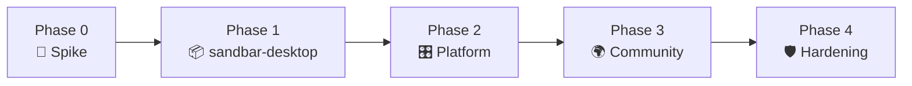

# Roadmap

> Building in public. Checkboxes update as things land — if it's checked, it's real and verified, not aspirational.

## Phase 0 — Spike ✅ (2026-07-19, amd64)

Prove every risky assumption in one throwaway image before building anything real.

- [x] Hermes installs and runs on a Debian 13 Selkies base image
- [x] Hermes computer-use works against the Selkies X server — screenshots + AT-SPI green; GUI input via xdotool/XTest (cua-driver's Linux background-input limitation documented in [`spike/README.md`](../spike/README.md))
- [x] Hermes TUI runs under ttyd
- [x] Exec-approval behavior: headless runs execute without prompts; deliberate review still open (Phase 1)
- [x] RAM/CPU envelope measured (~720MiB / ~3% CPU idle)
- [ ] Same image builds and runs on arm64 → moved to Phase 1 CI

## Phase 1 — `sandbar-desktop` (Tier 0) — in progress

The one-command agent computer.

- [x] Multi-arch image (amd64 + arm64) published to GHCR, built on native runners — `docker run ghcr.io/jdrolls/sandbar-desktop:latest` verified boots to onboarding (amd64 fully; arm64 boot verified under QEMU emulation — physical-Pi perf reports welcome)
- [x] Desktop browser works out of the box (Chromium, flags preconfigured; container is the isolation boundary — Docker's default seccomp blocks the browser sandbox, custom seccomp re-enables it)
- [x] Hermes pinned to the v0.18.2 release commit (installer `--commit` flag); bumps are deliberate ARG updates, rebuilt and retested
- [x] First-run onboarding: no baked keys — native Hermes wizard in the chat pane; env keys skip it
- [x] Agent runs inside the desktop session (session user + session D-Bus), verified end-to-end: agent opened a terminal and typed into it
- [x] `sandbar-desktop` skill seeded (GUI control via shell + xdotool)
- [x] Agent adapter contract: `hermes` (default) and `none` (BYO agent via control API/MCP) via `SANDBAR_AGENT`
- [x] Non-root agent user (desktop session user, not root)
- [x] Control API (screenshot / click / type / key / scroll / bash / health / info) — token-gated, off by default; basic auth (`CUSTOM_USER`/`PASSWORD`) covers desktop + chat
- [x] The Window: desktop + chat in one page at `:8080/` (draggable split, per-surface links, secure-context hint)
- [x] Raspberry Pi guide ([docs/raspberry-pi.md](raspberry-pi.md))
- [x] Exec-approval model reviewed and documented (Hermes defaults kept: interactive classifier gates dangerous commands in the chat pane; hardening knobs documented)

## Phase 2 — Platform (Tier 1)

Provision many computers; keep it optional.

- [x] Bun/TS control plane (`platform/`): provisioning CRUD + dashboard, zero runtime deps (Bun.serve + bun:sqlite + Docker Engine API over the socket). Design choice: **per-computer host-port blocks instead of path-rewriting proxies** — Selkies/ttyd under rewritten paths is the fragility v1 died of; direct ports compose cleanly with Tailscale/your own proxy
- [x] Single-user token auth (generated at first run, printed once, stored in `/data/token`); per-computer control tokens minted at create time
- [x] `install.sh` — arch detect, Docker check/bootstrap, compose up, health wait, token handoff
- [x] MCP server (`platform/mcp/`) — list/create/delete computers + screenshot/bash/click/type/key as native tools; verified end-to-end from a real MCP handshake
- [x] Private-by-default access documented throughout (Tailscale serve tips in every guide); Cloudflare Tunnel + Caddy/LE remain user's choice
- [ ] Multi-user opt-in mode (accounts, per-user keys, admin)
- [ ] Publish `ghcr.io/jdrolls/sandbar-platform` image (today: `compose up --build` from the repo)

## Phase 3 — Community

- [ ] `openclaw` containment adapter + migration guide
- [ ] Takeover-mode polish (explicit human/agent control handoff in the UI)
- [ ] Docs site
- [ ] Launch write-ups: self-hosted agent computers, OpenClaw containment, agents on a Pi

## Phase 4 — Hardening & fleet

- [ ] sysbox opt-in runtime (Docker-in-desktop, real systemd)
- [ ] gVisor "untrusted agent" tier
- [ ] Computer templates & persistence/snapshot story
